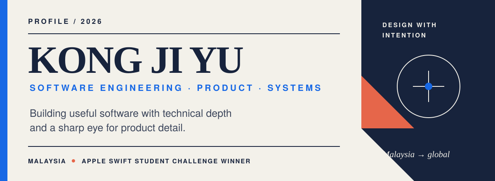

<picture>
  <source media="(prefers-color-scheme: dark) and (max-width: 600px)" srcset="./assets/profile-hero-mobile-dark.svg">
  <source media="(prefers-color-scheme: light) and (max-width: 600px)" srcset="./assets/profile-hero-mobile-light.svg">
  <source media="(prefers-color-scheme: dark)" srcset="./assets/profile-hero-dark.svg">
  <source media="(prefers-color-scheme: light)" srcset="./assets/profile-hero-light.svg">
  
</picture>

  <a href="https://jy-portfolio-six.vercel.app/"><strong>Portfolio</strong></a>
  &nbsp;·&nbsp;
  <a href="https://www.linkedin.com/in/ji-yu-kong-249516279/"><strong>LinkedIn</strong></a>
  &nbsp;·&nbsp;
  <a href="mailto:kongjiyu0198@gmail.com"><strong>Email</strong></a>

 

## I build software around real human and business needs.

I'm a Software Engineering student at **TAR UMT** with a **3.96 / 4.00 CGPA**, combining hands-on engineering with product thinking, client communication, and delivery ownership. My work spans accessible mobile experiences, privacy-first AI tools, CRM implementation, and full-stack systems.

> **Currently:** leading a five-member student digital-solutions team and seeking a **Jan–May 2027 internship** in software development, product, business analysis, CRM, or technology consulting.

 

## Selected work

### 01 — LearnBIM

APPLE SWIFT STUDENT CHALLENGE 2026 WINNER

An interactive iOS experience for learning **Bahasa Isyarat Malaysia** through guided reference videos and real-time gesture feedback. LearnBIM uses on-device computer vision and machine learning to make sign-language practice more active, private, and accessible.

`SwiftUI` &nbsp; `Vision` &nbsp; `Core ML` &nbsp; `AVFoundation`

**[Explore LearnBIM →](https://github.com/kongjiyu/LearnBIM)** &nbsp;&nbsp; [Watch the demo](https://www.youtube.com/watch?v=AiKgc819P6U)

---

### 02 — Remembry

PRIVACY-FIRST AI

A self-hosted desktop meeting assistant that transforms recordings into structured, searchable notes. Meeting data stays local in SQLite while AI supports transcription, decisions, summaries, and action-item extraction.

`Tauri` &nbsp; `Rust` &nbsp; `Next.js` &nbsp; `SQLite` &nbsp; `Gemini`

**[Explore Remembry →](https://github.com/kongjiyu/remembry-app)** &nbsp;&nbsp; [View live product](https://remembry.vercel.app/)

---

### 03 — STERAS

AUDITABLE PUBLIC-SERVICE WORKFLOWS

A tourism-event risk, review, and approval system designed around Malaysian public-sector workflows. It combines deterministic risk assessment, versioned evidence, multi-agency decisions, and carefully bounded advisory AI.

`React` &nbsp; `TypeScript` &nbsp; `Firebase` &nbsp; `Cloud Functions`

**[Explore STERAS →](https://github.com/kongjiyu/steras)**

 

## Recognition & delivery

| Recognition | Evidence of delivery |
| --- | --- |
| **Apple Swift Student Challenge 2026 Winner** — LearnBIM | Led scopes, prototypes, planning, and delivery for approximately **RM12,000** in client project value |
| **2nd Runner-Up, CodeNection 2025** — [Dotivra](https://github.com/kongjiyu/dotivra) | Supported a CRM rollout for approximately **50 users** and migrated **1,000+ product records** |
| **CGPA 3.96 / 4.00** — Bachelor of Software Engineering (Hons) | Participated in **20+ client meetings** across CRM and cloud solution consulting |

 

## Practice

<table>
  <tr>
    <td width="33%" valign="top">
      <strong>Engineering</strong>  
      Full-stack web 
      Mobile & desktop apps 
      AI-assisted workflows 
      Data & cloud systems
    </td>
    <td width="33%" valign="top">
      <strong>Product & delivery</strong>  
      Requirements discovery 
      Prototyping 
      Quality assurance 
      Team coordination
    </td>
    <td width="33%" valign="top">
      <strong>Business systems</strong>  
      CRM configuration 
      Workflow analysis 
      Data migration 
      User training
    </td>
  </tr>
</table>

### Selected technology

**Languages**&nbsp;&nbsp; Swift · TypeScript · JavaScript · Python · Java · C · Dart 
**Frameworks**&nbsp;&nbsp; React · Next.js · Flutter · Tauri · Firebase 
**Data & cloud**&nbsp;&nbsp; MySQL · SQLite · Supabase · Oracle Cloud · Vercel · Cloudflare 
**Delivery tools**&nbsp;&nbsp; Git · Docker · Bitrix CRM · WordPress · Notion

 

## Let's make useful things.

I'm interested in software that is useful, understandable, and grounded in real user needs. If you're building a thoughtful product, business system, or socially meaningful technology, I'd be glad to connect.

**[View my portfolio](https://jy-portfolio-six.vercel.app/)** &nbsp;·&nbsp; **[Connect on LinkedIn](https://www.linkedin.com/in/ji-yu-kong-249516279/)** &nbsp;·&nbsp; **[Send an email](mailto:kongjiyu0198@gmail.com)**

Based in Malaysia · Chinese / English / Malay
